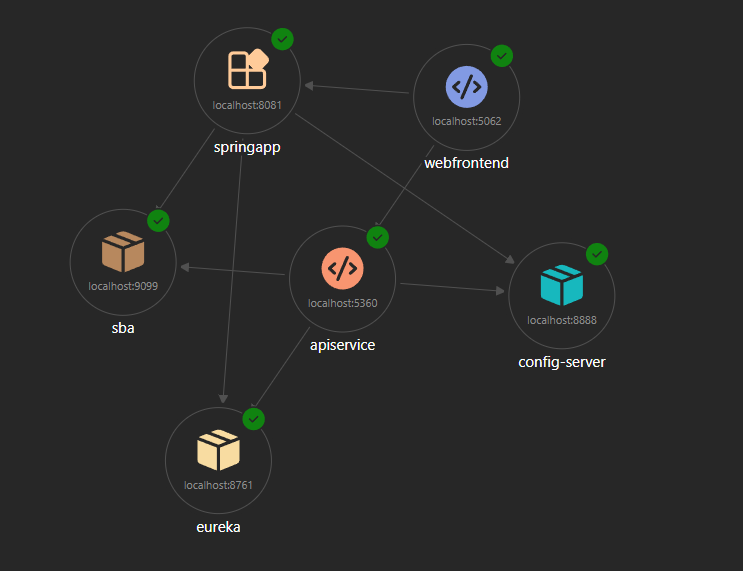

# Cloud-native .NET  with Steeltoe

Tim Hess

Software Engineer, Tanzu Division, Broadcom

  <button @click="$slidev.nav.openInEditor()" title="Open in Editor" class="slidev-icon-btn">
    <carbon:edit />
  </button>
  <a href="https://github.com/slidevjs/slidev" target="_blank" class="slidev-icon-btn">
    <carbon:logo-github />
  </a>

<!--
Hello everyone!

Thank you for joining me today. My name is Tim Hess, I'm a Software Engineer in the Tanzu Division at Broadcom, and I'm excited to talk to you today about building cloud-native .NET applications with Steeltoe.
-->

---
transition: fade-out
---

# Steeltoe Background

- Developed by Pivotal/VMware/Broadcom
- Improves developer experience with modern features
  - Bring productivity wins from Spring to .NET
- Open Source (Apache 2.0) since 2016
- Part of the .NET Foundation (obviously)

<!--
Let me start with a bit of background on this project.
Steeltoe is an open source project that has been developed primarily by employees of Pivotal, which became part of VMware, and is now part of Broadcom's Tanzu Division.
The core mission of the project has always been to reduce developer toil by providing modern and cloud-native features that are reliable and easy to use, so that you can focus on what makes your applications unique.

More specifically, as a member of the same organization that maintains the core Spring projects for the Java ecosystem, we aim to bring some of their productivity wins to .NET developers.
If that sounds odd to you, consider that Spring has been solving cloud scale problems for a very long time now - with popular open-source options for things like configuration management, service discovery and application management.
So why not allow .NET developers to use the same battle-tested options, especially for those organizations that use both Spring and .NET?

Steeltoe has been open source under the Apache 2.0 license since 2016. This means it's built with and for a community, with all the transparency and collaboration that open source brings.

The framework has evolved significantly over the years, and with our recently released version 4.0, we've made it feel more .NET-native than ever while still offering familiar features and interoperability with Spring projects where it makes sense.
-->

---
transition: fade-out
---

# What's changed in Steeltoe 4.0

- .NET 8+ Support
  - Updated dependencies
- Cleaner, more consistent APIs
  - Public API reviewed to eliminate duplication, improve clarity and consistency
  - Combined *Base and*Core packages
- Modern .NET Features
  - Nullable annotations
  - Embedded JSON schemas for better IDE completion with appsettings
- Removed components
  - Kubernetes API interactions
  - Messaging/Stream

<!--
Speaking of that 4.0 release, I'll spend a minute on what the big deal is.
This has been a significant release for us, and it is a major step forward in a number of ways.

First, **.NET 8+ Support** - Steeltoe 4.0 requires .NET 8 or later.
This move allowed us to take advantage of the latest .NET features and performance improvements, and ensures we're all building on a modern, supported platform.

We've also **updated all dependencies** to their latest stable versions, which means better security, performance, and compatibility with the broader .NET ecosystem.

One of the biggest improvements is **cleaner, more consistent APIs**.
We conducted a comprehensive review of our entire public API surface, enhancing XML docs, eliminating duplication and improving clarity.
We dramatically reduced what's publicly accessible so that it's clearer where the intended extensibility points are, and so that we can evolve the core of the project with reduced risk of breaking your code.
We've also improved our own tooling. Our builds are faster and catch more issues, so there will be fewer breaking changes going forward.

We've also embraced a number of **modern .NET features**, many of which were not around when much of Steeltoe was originally written.
I'm talking about things like adding **nullable annotations** throughout the codebase for fewer null reference exceptions, using `IOptions` in more places for improved runtime re-configurability, and removing some of our own abstractions that duplicated some of that functionality.
We are now embedding JSON schemas for configuration directly in our packages, so that you get IntelliSense and validation right in your IDE when editing appsettings.json files.
We're also embedding the debug symbols in the packages, so that you can step directly into the source code if you ever need to.

Finally, we have **removed some components** that were rarely used, have better alternatives or were not maintainable with the capacity available on our team.
These changes primarily affected components that interacted with the Kubernetes API and the Messaging and Stream components.
I was sad to remove them, but the messaging and stream components in particular were still very Spring-like, and at the time of removal was nearly 150,000 lines of code, so the maintenance burden there would have been more than we could handle.

The result of all of these changes is a much leaner, more focused framework and an easier and safer path forward for adding new features.
-->

---
transition: fade-out
level: 2
---

# What's included

### Steeltoe Components

- **Configuration**
  - Additional providers for Microsoft's `IConfiguration` system
- **Connectors**
  - Transform cloud credentials into connection strings
- **Service Discovery**
  - Dynamic service location and load balancing
- **Application Management**
  - Health checks, log levels, and more
- **Application Security**
  - Authentication, authorization, and security features

<!--
So now, what does Steeltoe actually provide? Let me give you a quick overview of the main components before we dive in.

First, **Configuration**: Steeltoe provides several configuration providers that integrate seamlessly with Microsoft's `IConfiguration` system.

We have **Connectors**, that transform cloud credentials into connection strings for databases, message queues, and other services.

Then there's **Service Discovery**, which allows you to register or find and connect to service instances dynamically.

**Application Management**, which includes HTTP endpoints that are compatible with the actuator endpoints that Spring Boot offers.
There are endpoints for things like refreshing configuration, performing health checks, managing log levels, taking memory dumps, and more.

We also offer several packages related to **Application Security**.
-->

---
transition: fade-out
---

# Separate Configuration from Code

### Steeltoe Configuration

- Spring Cloud Config Server
  - Git-backed, centralized configuration management
- Placeholders (`"MyAppName": "${Spring:Application:Name?unknown}"`)
- Cloud Foundry Environment Variables (`VCAP_APPLICATION`, `VCAP_SERVICES`)
- Random Values
- Decryption
- Spring Boot (for use with `SPRING_BOOT_APPLICATION`)

*Each of these implement `IConfigurationProvider`

<!--
Let's dive into configuration management.

One of the fundamental principles of cloud-native applications is that configuration should be separate from code.
Your application code shouldn't change when you move from local development to staging to production - only the configuration should.

All of Steeltoe's configuration libraries live in Microsoft's IConfiguration world, so they are very natural to use.
You use the same patterns you're already familiar with, whether that's getting values directly from IConfiguration or using the Options pattern.

The demo I'm going to run through in a moment uses **Spring Cloud Config Server** for centralized configuration management.
Config Server is one of the most popular components in the Spring Cloud ecosystem, because it allows you to simplify and centralize the configuration for distributed applications.
Config Server includes more features than I really have time to cover today, so if it sounds interesting just know that we're only scratching the surface!
One of the core features is the conventions config server supports.
As I'm sure you already know, .NET apps most commonly start with appsettings.json and use the appsettings.environment.json convention, where the environment name aligns with `ASPNETCORE_ENVIRONMENT`.
Config server has that idea too, but since its built for distributed applications, there are additional conventions that make it easy to keep settings synchronized across multiple applications and environments while maintaining a single source of truth.
Multiple file formats are supported, and you can organize your settings files by things like app name, environment name or several other patterns.
The most common way to use config server is with a git repository, where you can store all of those configuration files in a version-controlled repository so that you can version them, and have the config values automatically picked up by your apps.

Steeltoe supports several more, fairly powerful, configuration providers:

- Like **Placeholders**, where you can use expressions like this ${some-other-config-key, with the ability to fall back to yet another configuration value or some default value
- The **Cloud Foundry** provider automatically parses `VCAP_APPLICATION` and `VCAP_SERVICES` for integration with Cloud Foundry-based application platforms.

Quick aside here, I may mention Cloud Foundry a few more times today.
If you don't know what that is, that's ok - you don't need to know anything about it to use Steeltoe and you don't need Steeltoe to use Cloud Foundry.
It is a platform that's near and dear to me though, and is one of the best places to run Steeltoe-enhanced apps.

Moving on, we also have:

- **Random Values** - for generating random strings, numbers, guids, etc. You might consider using it with placeholders.
- **Decryption** - Decrypt sensitive values in your configuration repository
- **Spring Boot Configuration** - which provides compatibility for several Spring-related scenarios.
-->

---
transition: fade-out
---

# Configuration Demo

<!--
Today's demos will all use the same distributed application that was built from the Aspire Starter App template, which you've probably already seen before.
You can tell from this diagram that what we're working with here is a bit more complicated, but you can still expect a few very detailed and extremely reliable weather forecasts coming your way.

This App consists of the standard Blazor Server web frontend and .NET Web API service, with the addition of a Spring Boot API that mirrors what the .NET API does, a Spring Cloud Config Server, a Eureka server and Spring Boot Admin for showing what actuators can do.

All of which is orchestrated with Aspire, of course -- related to that note about Aspire, I'll say right away that I'm about to show some APIs that aren't public yet - this Aspire integration is still a work in progress, so you will see some code you can't use quite yet, but all of the outcomes we're achieving are already possible.

So let's take a look at what I've put together.
=> Show VS Code, AppHost.cs

Here we're adding a Config Server resource that uses a local directory for configuration.
Config server is an open source package that you can add to any Spring app, so you don't have to do it exactly this way, but this app is spinning up a container with the image that we use for Steeltoe development.
You can also use our image for local development, but this particular implementation is not for use in production!

In a typical non-local situation you'd probably point this at a Git repository, but for the purpose of quick iteration we're using a local path for now.
This application.yaml file contains default values that will be used for any application reading from this config server, in this case it's holding the standard Summary options for a .NET demo weather forecast.

Let's look at how the .NET API service uses Steeltoe to consume this configuration.

=> Show Program.cs, line 13

This is all it takes! The `AddConfigServer` extension method sets up Steeltoe's Config Server client. It automatically connects to the Config Server over HTTP, retrieves configuration, and makes it available through IConfiguration.

Notice we're using the BootstrapLoggerFactory here. This is an optional feature that Steeltoe provides for easy logging during the configuration phase, before the main logging infrastructure is set up. If you use the hostbuilder extension like this, we also register an IHostedService that will swap out the bootstrap logger when the runtime loggers are ready to go. If you don't care about those logs, you can skip over that part and use the parameter-less version.

=> Line 22 then into WeatherOptions.cs, then back to line 32 in Program.cs

Were doing a pretty standard AddOptions call here and binding to the parent key of WeatherOptions.
The class itself just holds the summaries that can be used in the forecast.
We're using that configuration-bound class through IOptionsSnapshot, so that we have the latest summary options on every web request, which pairs nicely with Steeltoe's built-in option to periodically refresh the data from config server. I have that set to check every 10 seconds for this demo

=> Switch to dashboard

This is the Aspire dashboard - see config-server here? I'll just click this Default config link quickly and you can see the path for the http request and the response that Steeltoe is reading in.

Let's see what this looks like from the web frontend.

=> Switch to blazor app /weather

Now, I mentioned something about centralized configuration and keeping apps in sync, didn't I?

Let's change the config and see what happens...

=> vscode
-->

---
transition: fade-out
---

# Local and Cloud-Provisioned Services

### Steeltoe Connectors

Transform cloud credentials (like `VCAP_SERVICES`) into connection strings

- Common Supported Services:
  - Microsoft SQL Server
  - MongoDB
  - MySQL
  - PostgreSQL
  - RabbitMQ
  - Redis/Valkey

<!--
Next up is Steeltoe Connectors. While we're not demonstrating them in this talk, they're a valuable part of the Steeltoe ecosystem.

Connectors automatically transform cloud platform credentials into connection strings. The idea is that when you run on Cloud Foundry or other platforms that offer a service binding implementation, a relationship between your app and the backing service is created, generally with credentials that are unique to that specific binding. The credentials are provided to your application through environment variables like `VCAP_SERVICES` or in the key-per-file style where the filename is the key and the file content is the value. Parsing these manually can be error-prone and tedious, but Steeltoe makes it easy.

Steeltoe Connectors handle this automatically. They support services like:

- Microsoft SQL Server
- MongoDB
- MySQL and PostgreSQL
- RabbitMQ
- Redis and Valkey

The connector reads the service binding, extracts the connection information, and provides it to your application through standard .NET interfaces. Your code doesn't need to know whether it's running locally with a connection string in appsettings.json or in the cloud with VCAP_SERVICES - the connector abstracts that away.
-->

---
transition: fade-out
---

# Locate Service Instances

### Steeltoe Service Discovery

- Find services or service instances by name
  - Client-side load balancing
  - `HttpClientFactory` integration
- Services manage their own registrations
  - Register at startup
  - Deregister at shutdown
- Registry Options
  - Spring Cloud Netflix Eureka
  - HashiCorp Consul
  - Configuration

<!--
One essential aspect of that demo that I glossed over is service discovery.
In a microservices architecture, services need to find each other.
Hard-coding URLs doesn't always work when service instances can come and go, when you want to define your own load balancing policy, or maybe you just don't trust DNS anymore after getting burned too many times.

While Microsoft relatively recently added some first-party packages in this space, in combination with Spring, Steeltoe has been providing features for service discovery and service registration for almost a decade.
Service instances register themselves with a registry when they start up, and other apps can discover the addresses of those services using a service name rather than needing to know the address in advance.
Just like externalizing your configuration, using this pattern makes your applications even more portable.
Actually Steeltoe even offers a feature also found on the Spring side that's called discovery-first configuration that combines these two items, so if you went to the extremes with it, the only config your app needs at startup is the address of the service registry. 

Some of the key features in Steeltoe include:

- **Client-side load balancing** connect directly to service instances without a need for a separate load balancer. We include Random and Round-Robin by default, you can provide your own if you want.
- **HttpClientFactory integration** we have some work to do in order to use the Microsoft abstractions but should be available in next release.
- **Self-registration** - Services manage their own lifecycle, registering at startup and deregistering at shutdown.

Steeltoe supports multiple registry backends:

- **Spring Cloud Netflix Eureka** which is what we're using in the demo
- **HashiCorp Consul** - Another popular option
- Configuration, which you probably only want to use locally, since it's static, but maybe you don't want to run a registry but want similar behavior

Let me show you how this works.
-->

---
transition: fade-out
---

# Service Discovery Demo

<!--
In our demo, we're using Eureka via some prototype extensions for Aspire that integrate Steeltoe's Eureka client with Aspire's service discovery system. This means you will be able to use Aspire's service discovery APIs, and under the hood, Steeltoe will handle the Eureka integration.

First, let's look at how we set up Eureka in the AppHost.

=> Show AppHost.cs - line 12

This line adds a container that uses another Steeltoe development image, this time for a Eureka server.

=> Show AppHost.cs - line 21
The `WithEurekaRegistration()` extension method just tailors some of the Eureka client settings for Aspire orchestration.

Now, the really interesting part is how services discover each other. Let's look at the Web frontend."

=> Show Web/Program.cs - line 22

Notice the URL uses weatherservice as the hostname. This isn't a real URL - that's a service name.
The service discovery plumbing will resolve this name to actual service instances.
Aspire projects can already do this bit using several mechanisms, but we're working on a new service endpoint provider that bridges Microsoft's service discovery interface with Steeltoe's Eureka client.

Let me show you this running. First, let's check the Eureka dashboard."

=> Show Eureka dashboard at localhost:8761

You can see both the .NET API service and the Spring Boot service registered with Eureka.
They've registered themselves with their service names and you can see they're both "UP" now.

When the Web frontend makes a request to `http://weatherservice`, the service discovery system calls our Eureka provider, which uses data from Eureka to get the list of instances, and return them. Requests are then balanced between the service instances.

You already saw the results of this in action in the browser, but let's go look at the traces to get more info.
Something is wrong with my boot app and it's traces aren't making it into the dashboard.
Yeah, I probably should have fixed it before today, but here we are.
At any rate, that can serve as a pretty clear indicator for us which service handled the request.

Let's see what happens when we stop one of the services
*Stop .NET service
*Make a bunch of requests
*Check Traces
*Eureka dashboard

And that's the basics of service discovery!
-->

---
transition: fade-out
---

# Manage and Monitor Applications

### Steeltoe Management

- Spring Boot compatible Actuator Endpoints
  - Dynamic log level management
  - Build and arbitrary information
  - Health checks
  - Heap and Thread Dumps
  - HTTP Exchanges
  - Configuration Refresh
  - ... and more
- Administrative Tasks
  - Pairs nicely with cf run-task
  - Runs in same context as application

<!--
Now let's talk about application management and monitoring.
Steeltoe provides Spring Boot-compatible actuators; these are endpoints (exposed over HTTP) that give you insight into and control over your running applications.

We offer around 13 endpoints today that provide things like:

- **Dynamic log level management** - change log levels at runtime without restarting or changing file contents
- **Info endpoint** - quickly get application metadata, like git info, build version or with a custom `IInfoContributor` anything YOU want to include.
- **Health checks** - detailed health information, including dependencies. Steeltoe provides some abstractions, but is also compatible with Microsoft Health check interfaces.
- **Heap and Thread Dumps** - For debugging production issues
- **Refresh** endpoint that triggers configuration reloading. Can pair with Config Server to manage traffic to config server

In a minute, I'll show you **Spring Boot Admin** - which is yet another OSS project that provides a web-based UI for aggregating actuator endpoints from multiple applications.
It provides a single dashboard to monitor and manage all your services that have boot-compatible actuators.
Ideally in the future we'll build something that's more native to Aspire for using these management endpoints.

Steeltoe can also add support for administrative tasks, which are triggered at startup through commandline parameters.
This feature was built to pair with Cloud Foundry's `cf run-task` command, for activities like database migrations.
The idea is that these tasks should run in the exact same context as your application, so they have access to all the same configuration and services or service bindings.
-->

---
transition: fade-out
---

# Management Endpoint Demo

<!--
First, let's see how we set up Spring Boot Admin in the AppHost.

=> Show AppHost.cs - line 13
Just one line? Yeah, this is another Steeltoe development image.

=> Show AppHost.cs 43/54
These lines don't actually add the actuators to the app

The `WithActuators()` extension method configures the service to expose actuator endpoints and register with Spring Boot Admin.
Let me show you what this looks like in the Spring Boot Admin UI.

**[Navigate to Spring Boot Admin at localhost:9099]**

You can see both the .NET API service and the Spring Boot service registered here. Let's click on one of them.

**[Click on a service in Spring Boot Admin]**

"Here you can see:
- **Health status** - Is the service healthy? What about its dependencies?
- **Metrics** - JVM-style metrics, even for .NET services
- **Logs** - View and search application logs
- **Environment** - All configuration values
- **Threads** - Thread dump information
- **Heap** - Memory information

This is incredibly useful for operations teams. Instead of SSHing into servers or parsing log files, you have a web-based UI that shows you everything about your services.

Let me also show you the actuator endpoints directly."

**[Navigate to actuator endpoint, e.g., localhost:5001/actuator/health]**

"Notice that the health check includes information about dependencies - the Config Server and the Discovery Client. This is much more useful than a simple 'I'm alive' check.

Let's also check the info endpoint."

**[Navigate to /actuator/info]**

"This shows build information, Git commit information if available, and any custom info you've configured.

And we can see metrics."

**[Navigate to /actuator/metrics or /actuator/prometheus]**

"These metrics can be scraped by Prometheus or any other monitoring system that supports the Prometheus format.

The key point here is that Steeltoe's actuators are Spring Boot-compatible, which means:
1. They work with Spring Boot Admin out of the box
2. Operations teams familiar with Spring Boot will feel at home
3. You get the same observability patterns whether you're using Spring Boot or Steeltoe"
-->

---
transition: fade-out
---

# Security and Scalability

### Steeltoe Security

- Easily configure ASP.NET Core security libraries to work with UAA or SSO Tile
  - Single Sign-On with OpenID Connect
  - Resource protection with JSON Web Tokens (JWT)
- Use Instance Identity credentials for mutual TLS
  - Easily restrict service access to applications in same org and/or space
  - Platform-managed credential rotation every 24 hours
- Use Redis/Valkey with Microsoft Data Protection libraries
  - Built on Redis connector
  - Share session state between app instances for horizontal scale

<!--
I want to briefly touch on Steeltoe Security, even though we're not demonstrating it in this talk.

Steeltoe Security is primarily focused on Cloud Foundry-related technology and provides integration with:
- This thing called UAA (which stands for User Account and Authentication) server and the SSO Tile, which is built on UAA.
  - Steeltoe offers extensions that configure the ASP.NET Core security libraries for Single Sign-On with OpenID Connect and for JWT for resource protection and service-to-service authentication
- We also offer an authorization layer for the ASP.NET Core's Certificate Authentication that uses application instance identity certificates to validate that a calling application is authorized for a given action.
  - This is for mutual TLS between services. Cloud Foundry manages certificates that rotate every 24 hours, and this library uses them to allow locking things down to apps in same org and/or space
- **Redis/Valkey with Microsoft Data Protection** this one is primarily for sharing session state between application instances, to enabling horizontal scaling

That brings us to the end of what we consider the core components of Steeltoe - we do have one more project I'd like to touch on today...
-->

---
transition: fade-out
---

# Streamlined Project Generation

### Steeltoe Initializr

- Inspired by Spring Intializr/start.spring.io
  - Steeltoe Intializr/start.steeltoe.io is a fork
  - Everything behind it is customized for .NET
- Fundamentally based on .NET templating
  - Use with dotnet new
  - Use with any IDE, such as Visual Studio

<!--
One of the things that made Spring Boot so popular is Spring Initializr - start.spring.io.
It may seem to be a bit foreign of an idea to .NET users to go to a website to start a new project, but the idea is that you can select the dependencies you need and Initializr knows which versions of the runtime and packages go well together and allows you to download a ready-to-go project.
Or you can use the "Browse" mode to just look at what happens when you add or remove a given dependency.

We wanted the same experience for Steeltoe, so we created **start.steeltoe.io** - the Steeltoe Initializr.

The front end is actually a fork of Spring Initializr, but everything behind it is customized for .NET. You can:
- Select your .NET version
- Choose Steeltoe components (Config Server, Eureka, Actuators, etc.)
- Add other dependencies
- Generate a project

And it's fundamentally based on .NET templating, so you can also use it with `dotnet new` or any IDE like Visual Studio.

But here's the really powerful part: you can fork the Initializr and create your own tailored project generator for your organization. You can embed:
- Your organization's standards
- Your preferred dependencies and versions
- Your best practices
- Your internal libraries

This means new projects start with your organization's standards from day one, not as an afterthought. This is a huge productivity win for teams.
-->

---
transition: fade-out
---

# Initializr Demo

<!--
Do File -> New in Visual Studio
Time permitting, show web interface
-->

---
transition: fade-out
---

# Previous Versions of Steeltoe

### Steeltoe 2.x line was built for .NET Standard 2.0

- Similar/same features as described earlier
- Compatible with .NET Framework 4.6.1 and above

### Should still work

- ASP.NET Core 2.3
- Re-release of ASP.NET Core 2.1 → Core on Framework is back!

### Do you want this?

- There are currently no plans for revisiting Steeltoe on .NET Framework
- Investment here won't happen without demand

<!--
I want to take a moment to address .NET Framework support, because this comes up from time to time.

Older versions of Steeltoe - specifically the 2.x line - were built on .NET Standard 2.0, which means they supported both .NET Core and .NET Framework. The 2.x packages are still available on NuGet and *should* continue to work with .NET Framework 4.6.1 and above.

With the release of ASP.NET Core 2.3 earlier this year, ASP.NET Core on .NET Framework is back, and there's been some renewed interest in this space.

However, I want to be transparent: **we currently have no plans to revisit .NET Framework support in future Steeltoe releases**.
Our focus is on modern .NET - .NET 8, 9, 10 and beyond - where we can take full advantage of the latest features and performance improvements.

That said, we're a community-driven project. If there's significant demand for .NET Framework support, and if community members are willing to contribute and maintain that support, we're open to discussing it. But it won't happen without clear demand and community involvement.

If you're still on .NET Framework and want Steeltoe features, the 2.x packages are already there for you to try, let us know if you do.
I do strongly encourage you to migrate to modern .NET when possible - the benefits are substantial and Steeltoe 4.0 is designed specifically for the new stuff.
-->

---
transition: fade-out
layout: two-cols-header
---

# Thank you

 

## Stay in touch

 

::left::

### 📱 Social Media

**Twitter/X**  
@SteeltoeOSS

**BlueSky**  
@steeltoe.io

::right::

### 🔗 Resources

**Documentation**  
steeltoe.io/docs

**GitHub**  
github.com/SteeltoeOSS

**Initializr**  
start.steeltoe.io
